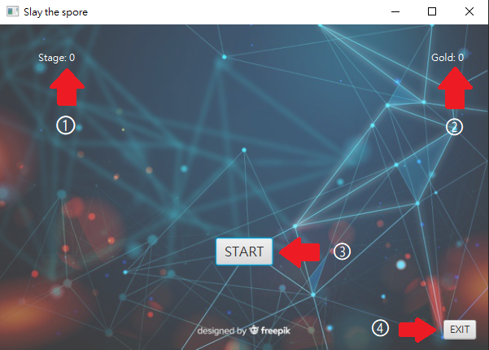
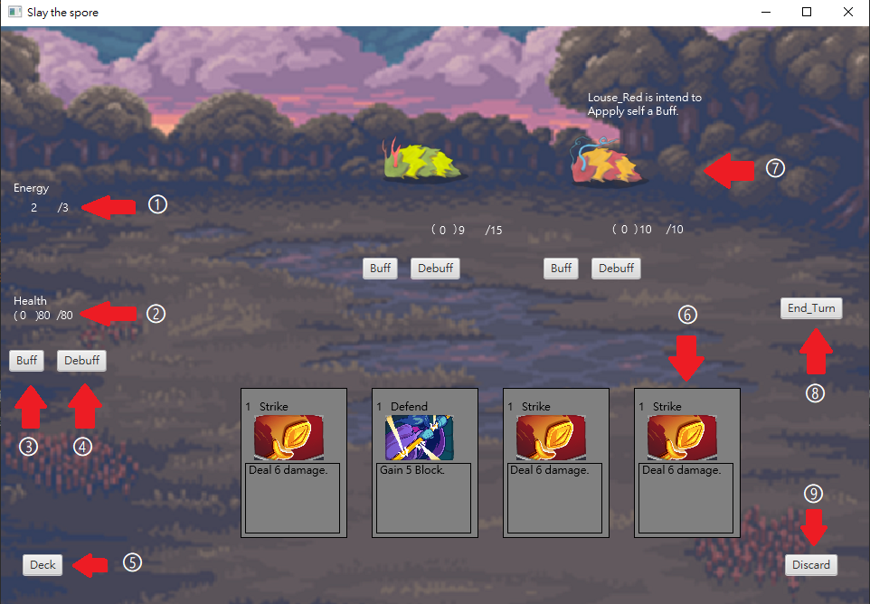
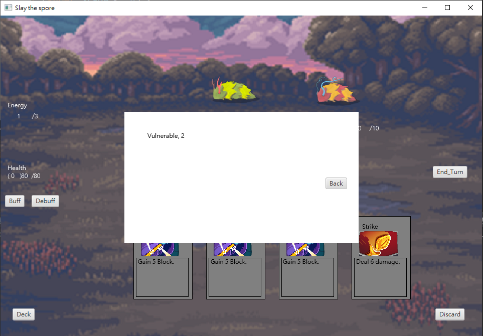
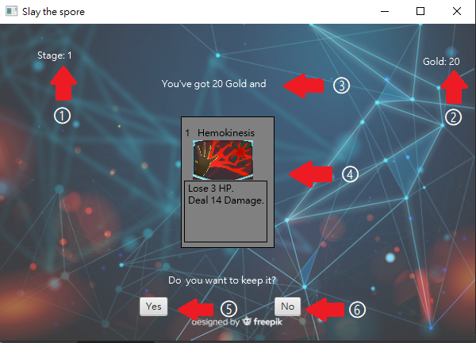
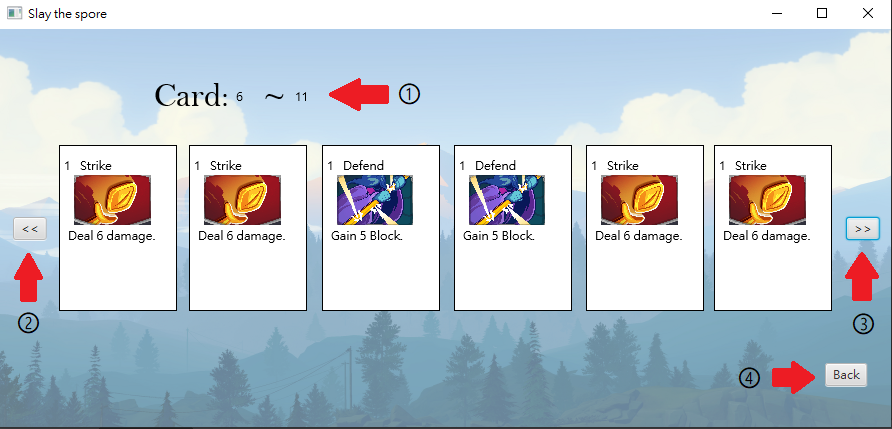
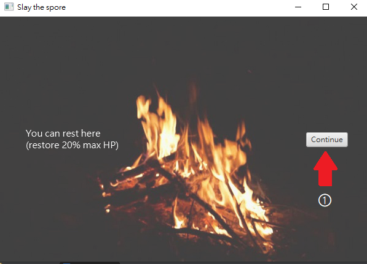
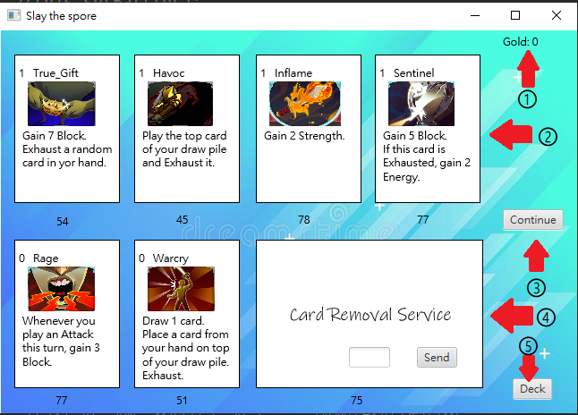

# Slay the Spore

資工 1A-108502005 戴裕笙

### 一、前言

以遊戲《殺戮尖塔》為原型，將其系統大部分完成，還原出遊戲的樣貌。

### 二、機制說明

本遊戲為卡牌遊戲，除了預設牌組外，所獲得的卡都是隨機的，不同卡牌能力也天差地別。

在戰鬥中，玩家每回合會補滿能量至上限，並抽取 5 張牌，玩家可以用滑鼠選取卡牌(點擊)，所選的卡牌將以紅色外框顯示，然後再點擊欲施放的目標，若成功發動則扣
除卡牌消耗能量並將該張牌移至棄牌堆(特殊效果者除外)，若卡牌無目標就隨意點選任何一個敵人便可施放。

回合結束後則輪到敵方行動(滑鼠移至敵人上方可得知敵人將要進行的動作)，並將剩餘手牌放入棄牌堆。在抽牌時，若牌堆中沒有牌，則會將棄牌堆洗回牌堆再進行抽牌。

在玩家勝利後，將會恢復 6 點生命值，並且敵人會掉落金幣與 1 張牌，玩家可以選擇是否要將該張牌加入牌組。

有時在按下開始後會遇到休息點、商店，休息點能讓玩家恢復 20%最大生命值，而商店則能花費金幣購買卡牌或從牌組中移除特定的牌。

本遊戲共有 10 關，其中前 3 關必定為戰鬥，第 9 與第10 關將分別是休息點與 Boss 戰，其餘關卡皆為隨機出現。

### 三、操作說明

##### 1.主畫面

↑圖1-主畫面

①Stage:顯示目前的關卡數

②Gold:顯示目前所持有的金幣數量

③Start:按下前往下一關卡

④Exit:按下以離開遊戲

##### 2.戰鬥畫面

↑圖2-戰鬥畫面

①Energy:能量，顯示目前/最大能量，每回合會自動補滿。

②Health:血量，括號內為格檔值，傷害會優先扣除格檔值，血量不會自動回復。

③Buff:增益，按下以檢視自身所擁有的增益，畫面如圖 3。

④Debuff:減益，按下以檢視自身所擁有的減益，畫面與圖 3 相同。

⑤Deck:牌組，按下以檢視牌組(牌會依照順序抽出)。

⑥Card:牌，左上方為消耗能量，正上方為卡牌名稱，中間為效果描述，若手牌超過 5 張則會顯示翻頁的箭頭。

⑦Enemy:敵人，擁有各自的血量、增益、減益，將滑鼠移至上方將顯示敵人的意圖。

⑧End Turn:結束回合，按下以結束回合，輪到敵方行動。

⑨Discard:棄牌堆，按下以檢視棄牌堆。

↑圖3-增益顯示

##### 3.勝利畫面

↑圖4-勝利畫面
①Stage:顯示目前的關卡數

②Gold:顯示目前所持有的金幣數量

③Dropped Gold:當前關卡掉落的金幣數量

④Dropped Card: 當前關卡掉落的卡牌

⑤Yes:獲得該張卡牌

⑥No:不獲得該張卡牌

##### 4.牌堆畫面

↑圖5-牌堆畫面

①Index:顯示該頁牌的編號(由左至右)

②Last Page:按下以顯示牌組上一頁

③Next Page:按下以顯示牌組下一頁

④Back:按下以返回(戰鬥頁面或商店)

##### 5.休息點畫面

↑圖6-休息點畫面

①Continue:繼續並回到主畫面

##### 6.商店畫面

↑圖7-商店畫面

①Gold:目前所持有的金幣數量

②Cards:可購買的卡牌，下方為金額，點擊後將跳出確認頁面，按下”Yes”即可購買(同張牌限買 1次)

③Continue:繼續並回到主畫面

④Card Removal Service:將牌從牌組移除，可看過牌組後輸入欲刪除的牌的編號，一樣會跳出確認頁面，也只能使用 1 次。

⑤Deck:按下以檢視牌組

### 四、補充說明

由於卡牌遊戲中會出現許多關鍵詞，以下列出表格說明。

| 英文名稱 | 中文名稱 | 效果 |
| :----: | :----: | :---- |
| Damage | 傷害 | 造成傷害以扣除護甲值與生命值，當生命值歸零時死亡 |
| Block | 格檔 | 格檔值會優先於生命值扣除，但回合開始時歸零 |
| Exhaust | 消耗 | 擁有消耗的卡牌在打出時會暫時移出該場戰鬥 |
| Ethereal | 虛無 | 擁有虛無的牌若回合結束時仍在手牌中將自動被消耗 |
| Strength | 力量 | 增益，攻擊會額外造成 **1*等級** 傷害 |
| Ritual | 儀式 | 增益，每回合獲得 **1*等級** 力量 |
| Dexterity | 靈巧 | 增益，格檔時獲得額外 **1*等級** 格檔值 |
| Metallicize | 金屬化 | 增益，回合結束時獲得 **1*等級** 格檔值 |
| Enrage | 惹怒 | 增益，每當玩家打出技能牌，獲得 **1*等級** 力量 |
| Vulnerable | 易傷 | 減益，受到額外 50%傷害 |
| Weak | 虛弱 | 減益，造成傷害減少 25% |
| Entangled | 束縛 | 減益，無法打出攻擊牌 |

↑表1-關鍵詞
